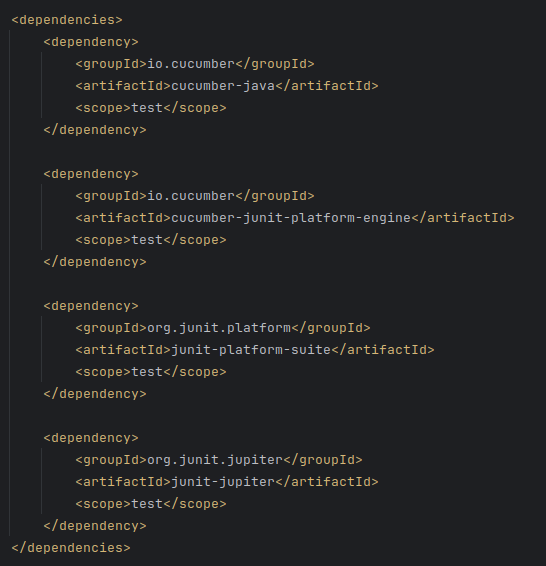
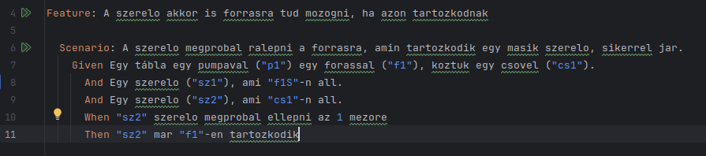
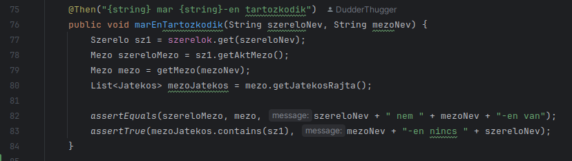

# Behaviour Driven Development

## Elvégzett munka

A projektünket kiegészítettük a BDD eszközeivel így támogatva az automatatesztelést. 
A funkció támogatásához először a Cucmber keretrendszerrel kellet megismerkednünk, majd a projektbe felvennünk. 
Ehhez első lépésként a kiegészítettük a pom.xml fájlt a keretrendszerrel és függöségeivel:

Következő lépésként szükség volt a projekt fájlrendszerének átalakításához: felvettük a cucumber által elvárt mappákat és egy csomagba szerveztük a forráskódot.

Ezek után megírtuk az automata teszteket. Egy ilyen teszt megírása egy gradle nyelven íródott feature fájl megírásával 
és az ott definiált lépések lekódolásával jár. Egy példa a feature fájlra és egy hozzá tartozó kódrészletre:

## Eredmények

Az automata tesztek bevezetésével elértük, hogy a jövőben a projektünk viselkedését tesztelhessük egyideűleg a fejlesztéssel, a jacoco plugin használatával pedig számon tudjuk tartani a kód tesztlefedettségét is.
A BDD alapú megközelítés meg elősegíti a tesztelő, fejlesztő és a megrendelő közti kommunikációt a könnyen értelmezhető, gradle 
nyelven írt követelmények, tesztek és funkciók miatt.

## Tanulságok

Az automata BDD tesztelés először ijesztő lépésnek tűnt, de végezetül a cucumber keretrendszere által nyújtótt lehetőségek 
intiutívanak bizonyultak. A tesztekkel pedig nagyon gyorsan lehetett növelni a kódlefedettséget is, mindamellett, hogy nem
ez az elsődelges célja a BDD teszteknek.
