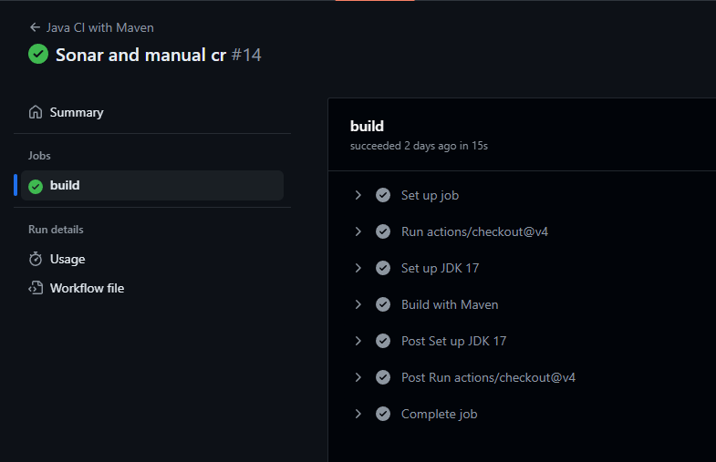
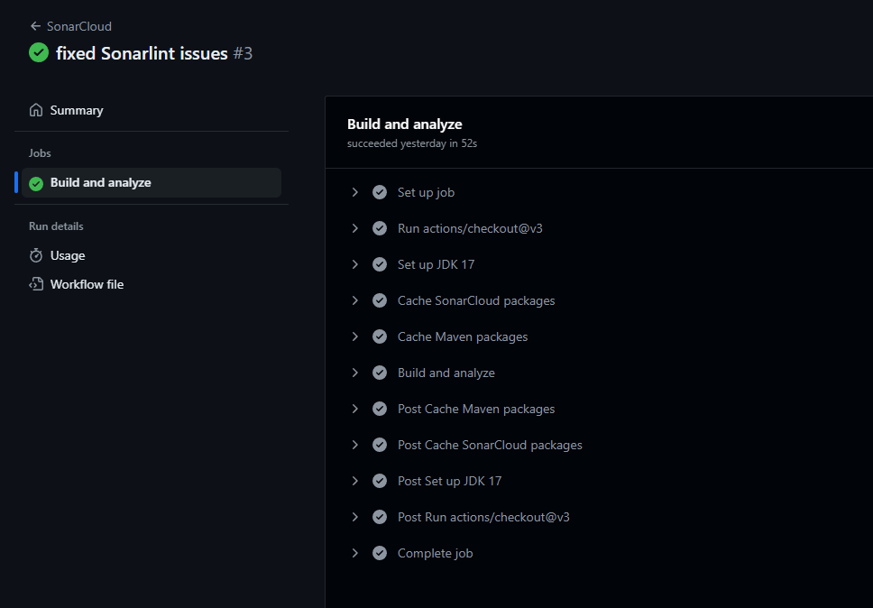
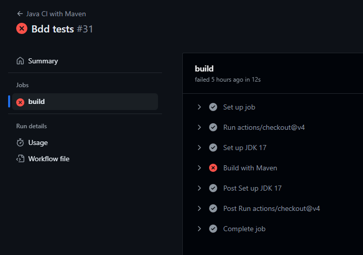

# Continuous Integration

## Elvégzett munka
A projekt eredetileg nem tartalmazott Maven vagy Gradle build keretrendszert, illetve semmilyen CI-funkció nem volt beállítva. A csapattagokkal való megbeszélést követően a Maven keretrendszer használata mellett döntöttünk.  A Maven 3.1-es verzióját választottuk és létre is hoztuk az ehhez szükséges pom.xml fájlt, ahol többek között az alkalmazás függőségeit lehet felsorolni. Kompatibilitás miatt a JAVA JDK 17-es verziója mellett döntöttünk, mivel a projektünk is erre a verzióra készült.  A Github Actions fülön legeneráltuk a maven.yml fájlt és kiegészítettük egy futtatási paranccsal is: mvn -B package --file pom.xml, aminek köszönhetően a projekt buildelése a Mavenen keresztül történik. 
Egy külön Github actionként felvettünk egy statikus analízis eszközt is, a SonarCloudot, ami a sima Maven build után lefut és elvégez egy analízist a frissített kódon.

## Eredmények
Összességében a CI bevezetésével egyszerűsítettük a hibák nyomonkövetését és a fejlesztő meg tud bizonyosodni a push műveletek után a kód helyességéről. 
Alább egy sikeres build valamint analízis eredménye látszik.

Sikertelen build eredmény is volt, amiről fejlesztőként azonnal visszajelzést kaptunk.

## Tanulságok
A projekt forráskódja nem volt a megfelelő hierarchiába rendezve eredetileg, ezért át kellett mozgatni az src/main/java mappába, hogy a Maven tudjon buildelni. Ez hasznos volt olyan szempontból is, hogy a projekt konvencióknak megfelelő legyen.
