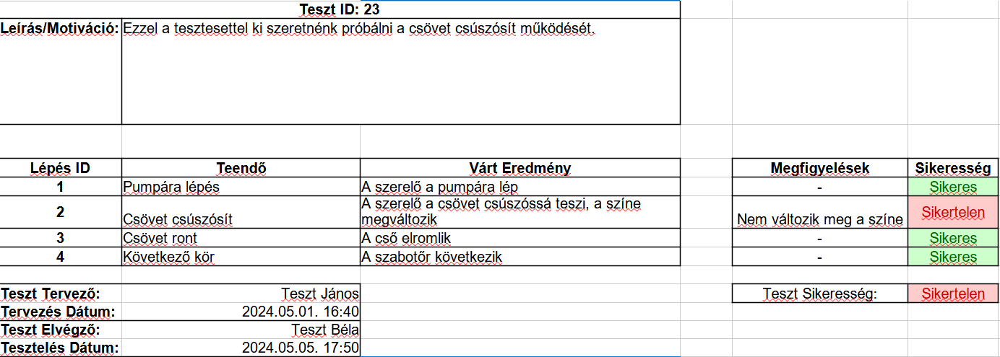

# Manuális Tesztelés

## Elvégzett munka
Első lépésben megvizsgáltuk, hogy milyen létező módszereket/sablonokat használnak manuális tesztelésre. Ezek alapján elkészítettünk egy flexibilis és átlátható teszt sablont, ami a jelenlegi projektünkhöz jól illett.
A sablon kinézete alább látható: 

Ezután elkészítettünk 10 komplex, összetett tesztesetet a játékos által választható fő akciókra fókuszálva. A teszteseteket úgy terveztük meg, hogy egy funkciót minél kimerítőbben teszteljenek.

Ezen tesztesetek:
- Víz folyása és Pumpa átállítása
- Mozgás
- Pumpák elromlása, javítása
- Pumpa felvétele, lerakása
- Tárgyak felvétele
- Cső csúszósítása
- Cső ragasztózása
- Cső lyukasztása, javítása
- Csővég felvétele és lerakása
- Cső állapotának változtatása

A tesztesetek elkészítése után azok működését ki is próbáltuk, a teszteket végrehajtottuk és dokumentáltuk.

## Eredmények
A tíz teszteset közül kilenc sikeresen lefutott, viszont egy elbukott. Ennek alaposabb megvizsgálás után a teszteset hibás specifikációját vettük észre, a program jól működött. A hibát dokumentáltuk, a tesztesetet javítottuk úgy, hogy az elvárt viselkedést nézze és a programot újra teszteltük. A teszteset második végrehajtásakor sikeres volt.

## Tanulságok
A program tesztelése hasznos betekintést nyújtott az egyes részeknek a működésébe. Azt is megtapasztaltuk, hogy a teszteseteket fontos pontosan a specifikációhoz illeszkedőn megfogalmazni. 