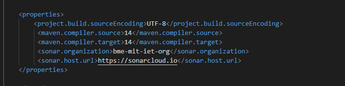

# Statikus tesztelés SonarClouddal és manuális kód átvizsgálás

## Elvégzett munka

A projektünket kiegészítettük a Sonar analízis család eszközeivel, ezzel megvalósítottuk az automatikus statikus tesztelést. 
A projektet össze kellett kötni a SonarClouddal, ehhez a SonarCloud felületén található útmutatót kellett követnünk, kiegészítettük a pom.xml fájlt a szükséges tulajdonságokkal:

Ezután létre kellett hozni az action futásához szükséges yaml fájlt. Így már sikeresen lefordul a github action, és a SonarCloud oldalán is láthatjuk az analízis eredményét. Az így talált hibákat javítottuk.

A SonarLint a Visual Studio Code bővítményei közül kell telepíteni, majd már használható is, kijelzi a kódban található hibákat, javítási lehetőségeket, ezeket javítottuk, átneveztük a nem megfelelő változókat, kiszerveztük a túlságosan komplex függvényeket.

A manuális kód vizsgálatát a Mezo.java, illetve a Kontroller.java osztályokra szűkítettük, mert nagyon időigényes lett volna az összes osztályt átvizsgálni, hatékonyabb a Sonar eszközök segítségével. A talált hibákat javítottuk.

## Eredmények

A SonarCloud felületen átlátható összefoglalást kaptunk a kód minőségéről, a tesztek által lefedet kódmennyiségről, ami a feladat végén sem volt a kívánt nagyságú, de ez annak tudható be, hogy többféle tesztet végeztünk, olyat is, amelyet a SonarCloud nem érzékel, illetve a játék grafikus részét nem fedik a tesztek, inkább a logikára koncentráltunk.

A SonarLint sok hibát jelzett, amik nagyrészt változók neveivel voltak összefüggésben, ezeket könnyen kijavítottuk, ezzel olvashatóbbá téve a kódot.

A manuális vizsgálat során nem sok hibába futottunk bele, egy jelentőset találtunk mindössze, egy TODO benne volt hagyva a kódban, az szerepelt benne, hogy kommentekkel kell még ellátni az osztályt. Ezt mi befejeztük, eltávolítottuk a TODO-t.

## Tanulságok

A SonarCloud nagyon hasznos projektek ellenőrzésére, ugyan esetenként feleslegesen jelez hibát, mint például a Random osztály használatára, de ettől eltekintve hasznos statisztikákat, és visszajelzéseket ad.

A SonarLint egyszerűen használható, sokat segít, hogy a hibához vonatkozó szabályokat is megmutatja. Könnyen olvashatóbbá tehető vele a kód.

A manuális tesztelés kifejezetten lassú, az ember nem annyira képes apró hibák észrevételére, még úgy is, hogy az esetünkben volt haszna kijelenthetjük, hogy az automatizálás rengeteget egyszerűsít a munkán.
